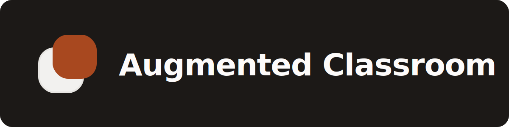

<p align="center">
  <a href="#-português">🇧🇷 Português</a> · <a href="#-english">🇺🇸 English</a>
</p>

## 🇧🇷 Português

Centraliza as turmas, materiais e prazos do Google Classroom com as notas e faltas do Lyceum num só lugar — sem alternar entre sistemas, sem a cara de portal acadêmico corporativo. O nome vem daí: é o Classroom *aumentado* ("augmented", no sentido de ganhar uma camada extra por cima, como numa realidade aumentada) com o que ele não tem, o Lyceum, numa camada só — inspirado na extensão Augmented Steam, que faz algo parecido com a loja da Steam. Cada pessoa roda a própria instância, com as próprias credenciais Google.

### Features

- **Turmas e materiais** do Google Classroom, com filtros por categoria, tipo de arquivo, tópico e status de download
- **Downloads** de materiais direto para a máquina local, com histórico e busca
- **pt/en** com troca de idioma na sidebar
- **Tema claro/escuro**

### Integrações

À medida que novas integrações forem entrando, elas aparecem aqui.

**Lyceum** — conecte em Configurações → "Conectar Lyceum", digite o subdomínio do seu Lyceum e complete o login na janela do navegador que abre (exigido pelo captcha do próprio Lyceum). Com a integração conectada, dá pra ver direto no app, sem abrir o portal:

- Histórico acadêmico
- Boletim (notas por disciplina)
- Faltas

### Getting Started

1. Clone o repositório e instale as dependências:

   ```bash
   npm install
   ```

2. Suba o servidor de desenvolvimento:

   ```bash
   npm run dev
   ```

3. Abra [http://localhost:3000](http://localhost:3000) — a primeira execução leva direto pro assistente de setup (`/setup`), que guia a criação de um projeto no Google Cloud Console e a configuração das credenciais OAuth (Client ID/Secret) para o Classroom e o Drive.

---

## 🇺🇸 English

Centralizes Google Classroom courses, materials, and deadlines together with Lyceum grades and attendance in one place — no switching between systems, no corporate academic-portal feel. Hence the name: Classroom *augmented* with the one thing it's missing, Lyceum, in a single layer — inspired by the Augmented Steam browser extension, which does something similar for the Steam store. Each person runs their own instance, with their own Google credentials.

### Features

- **Courses and materials** from Google Classroom, with filters by category, file type, topic, and download status
- **Downloads** materials straight to your machine, with history and search
- **pt/en** language switch in the sidebar
- **Light/dark theme**

### Integrations

As new integrations come in, they get listed here.

**Lyceum** — connect in Settings → "Connect Lyceum", enter your Lyceum subdomain, and complete the login in the browser window that opens (required by Lyceum's own captcha). Once connected, you get all this right in the app, no need to open the portal:

- Academic transcript
- Grades (per course)
- Attendance

### Getting Started

1. Clone the repo and install dependencies:

   ```bash
   npm install
   ```

2. Start the dev server:

   ```bash
   npm run dev
   ```

3. Open [http://localhost:3000](http://localhost:3000) — the first run takes you straight to the setup wizard (`/setup`), which walks through creating a Google Cloud project and configuring OAuth credentials (Client ID/Secret) for Classroom and Drive.
